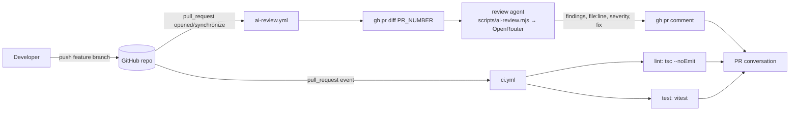
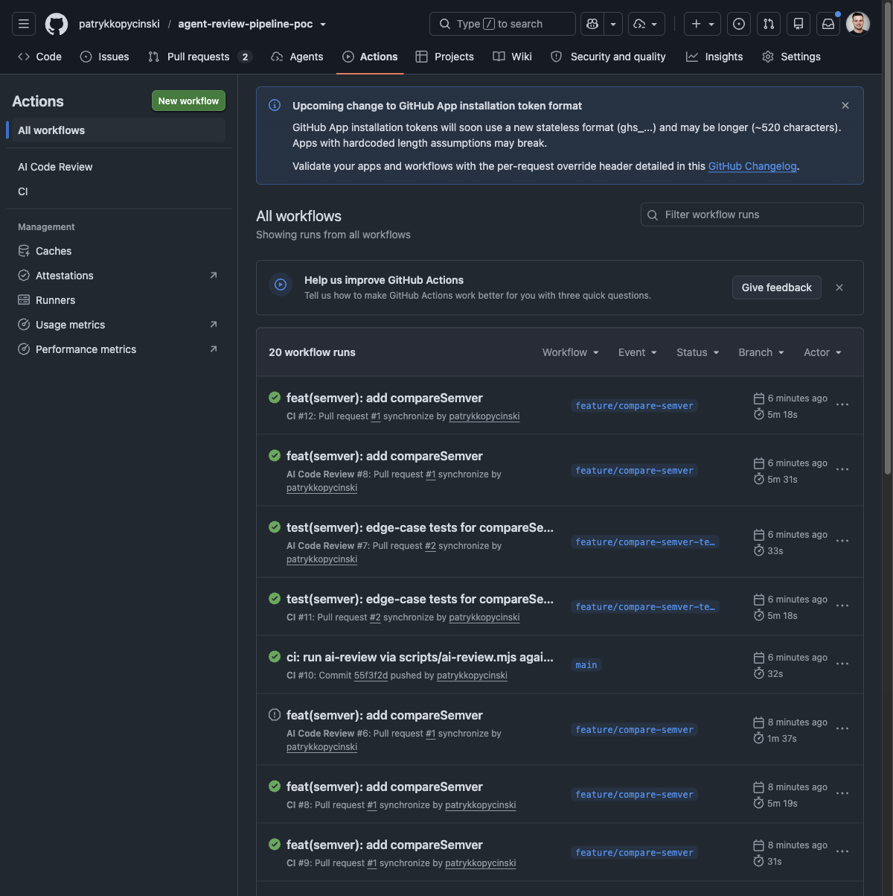
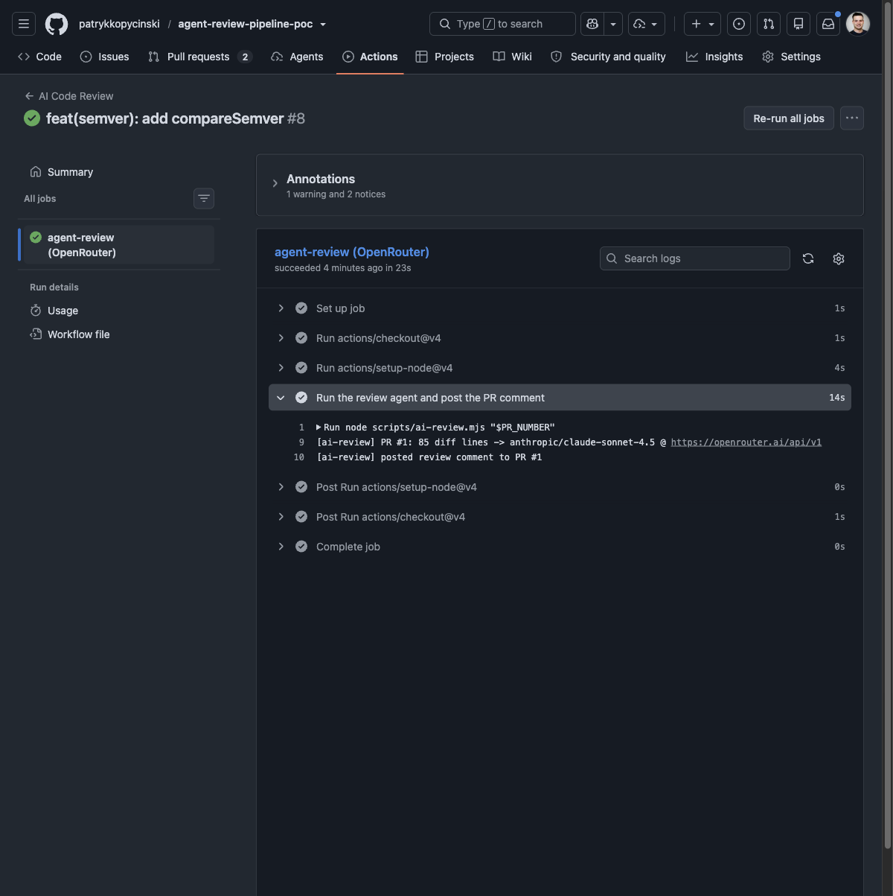
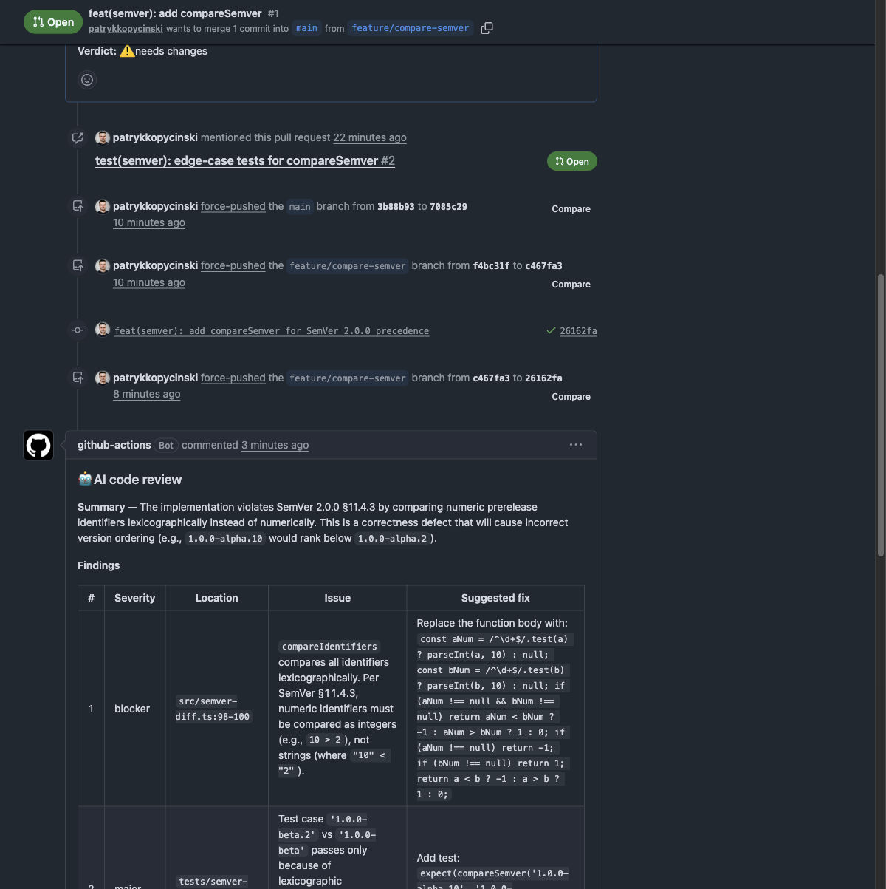

# agent-review-pipeline-poc

A small, self-contained proof of concept: **an AI agent performing code review inside a CI/CD pipeline.**

The repository holds a tiny TypeScript library (`semver-diff`) wired to a GitHub Actions
pipeline. On every pull request, one workflow runs lint + unit tests, and a second workflow
runs a code-review agent over the PR diff and posts the resulting review back to the pull
request as a comment.

> Status: PoC. The app is deliberately small so the pipeline and the agent's review are the
> interesting parts.

## What's here

```
src/semver-diff.ts   SemVer 2.0.0 parsing, formatting and bump classification
src/cli.ts           tiny CLI: `npm run cli -- <from> <to>`
tests/               vitest unit tests (happy paths + edge cases)
scripts/ai-review.mjs  local driver for the review agent (gh + OpenAI-compatible LLM)
prompts/code-review.md the review agent's system prompt (findings with file:line, severity, fix)
.github/workflows/ci.yml        lint + test jobs
.github/workflows/ai-review.yml review agent on PR opened/synchronize
```

Requirements: Node 22+, npm. No runtime dependencies.

```bash
npm ci
npm run lint      # tsc --noEmit
npm test          # vitest run
npm run cli -- 1.2.3 2.0.0   # -> bump: major
```

## Architecture



## How the review agent works

1. A pull request is opened or updated (`opened`, `synchronize`, `reopened`).
2. `.github/workflows/ai-review.yml` checks the repository out and fetches the PR diff with
   `gh pr diff $PR_NUMBER`.
3. The diff is combined with the system prompt in `prompts/code-review.md`, which instructs the
   agent to return findings that each cite `path:line`, carry a severity
   (`blocker` / `major` / `minor` / `nit`) and include a concrete fix.
4. The agent (`node scripts/ai-review.mjs $PR_NUMBER`) sends it to OpenRouter
   (`https://openrouter.ai/api/v1`, model from `REVIEW_MODEL`, default `anthropic/claude-sonnet-4.5`)
   using the `OPENROUTER_API_KEY` repo secret and produces a Markdown review.
5. The review is posted to the PR conversation with `gh pr comment` using `GITHUB_TOKEN`
   (`permissions: pull-requests: write, contents: read`).

Run the same agent locally:

```bash
export OPENROUTER_API_KEY=...   # optional: REVIEW_MODEL, LLM_BASE_URL
node scripts/ai-review.mjs <pr-number>
```

## Demo pull requests

- **PR #1** — adds `compareSemver` (SemVer §11 precedence) with a deliberate subtle defect; the
  agent's review flags it with a fix.
- **PR #2** — stacks a thorough test suite for the new function on top of PR #1.

## Screenshots

### 1. CI pipeline in the Actions tab


### 2. `ai-review` job logs


### 3. Agent review comment on PR #1

